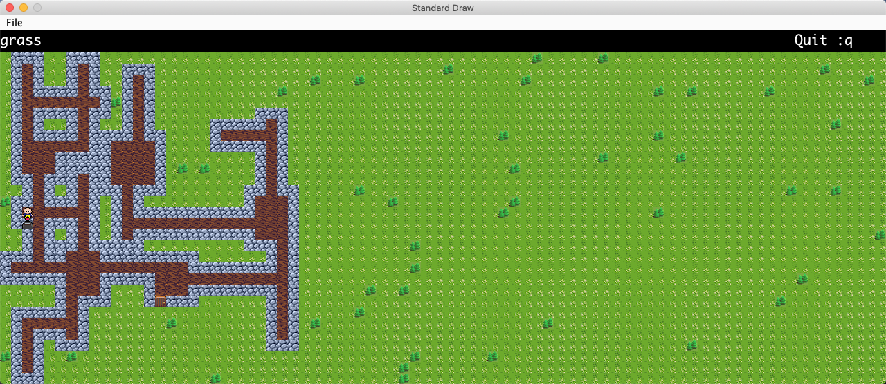

# BYOW: Build Your Own World

This is a simple 2D tile based RPG game uses custom engine built by the class staff.

At the beginning, player has 3 options, to start a new game, load a game, or quit the game. If player choose to start a new game, the game will ask player to input a number as the seed which will be used to randomly generate hallways and rooms based on the seed. If choose to load a game, the game will load from the saved state. If choose to quit, the game will shut down.

The goal of this simple game is to find the switch and the door in the map. At the beginning the player will only have partial vision to the map until finding the switch player will be able to.

This was an project from UC Berkeley CS61B Spring 2019, and here is the
[project description](https://sp19.datastructur.es/materials/proj/proj3/proj3)

## Showcase

Here are some show cases of this game.

### Starting Page
- Press `s` will start a new game, this will prompt a new page to allow player to input a number, after that press `s` the game will start.

- press `l` will load the game,

- press `q` will quit the game.

- Press `n` will prompt a new page to allow player to input a number, after that press `s` the game will start.

### In Game

- Press `w` `a` `s` `d` to move north, west, south, or east.

- Press `:q` to save and quit the game.

## Improvement

- The game will only end the player find the switch first then find the door.

- The game could have more levels.

- There are plenty of unused space due to the algorithm to generate the dungeon.

- This game is very simple and lacking variety, probably can add more elements to the dungeon such as adding some monsters. 
